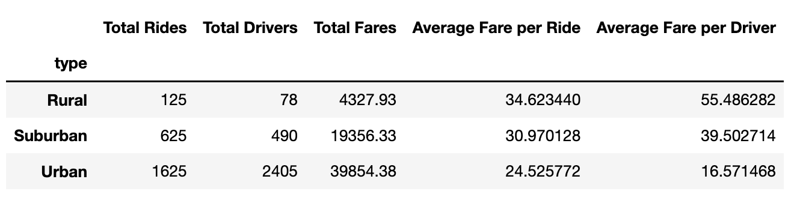
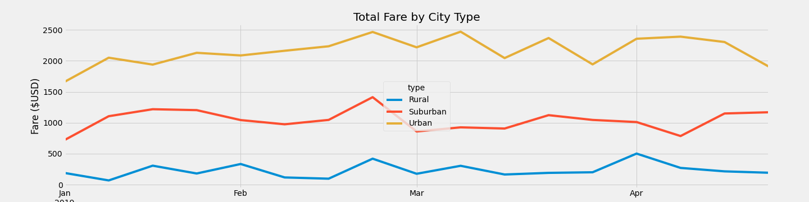

# Pyber analysis

## Project Overview
The purpose of this analysis was to look through a dataset containing "PyBer" data, a ride sharing app, and gathering insights from there. The main insights we looked into was splitting the city times into three seperate categories,"Rural","Urban", and "Suburban", to determine the total rides of each city type, total drivers in each city type,and the total fares and averages per ride/per driver.

## Results

Here is the PyBer Summary dataframe, which contains the data mentioned above in the project overview. It's very useful to view the data with the rows as city type, which allows us to view how well each city type is doing. This summary dataframe shows us that urban has the most rides/drivers, with 1625 rides in total, and 2405 drivers in the area. Suburban comes in at 625 total rides, and 490 drivers, and Rural with 125 total rides and 78 drivers.

